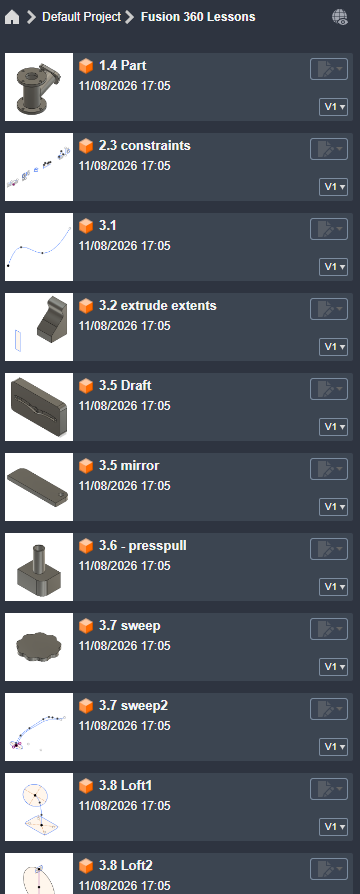
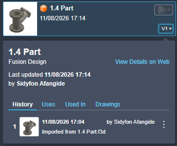
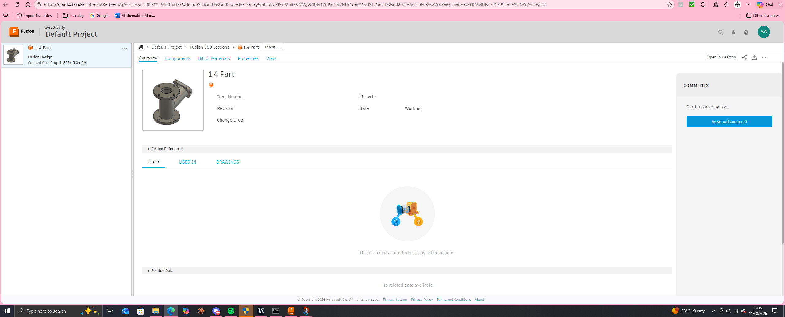

# Practical Evidence

Created a new project folder ("Fusion 360 Lessons") in the Data Panel to keep 
this course's work separate from my zeroGravity project files.

Uploaded/imported the course content I'd downloaded earlier into that project — 
confirmed it shows up correctly alongside my own test parts.

Tested drag-and-place by pulling a part into the workspace to load it.

Opened the cloud version of a file in my default web browser to confirm 
sync and sharing works as described.

Checked the version history on the cloud copy — confirms cloud saves are 
tracked with version numbers (V1) and timestamps automatically.

